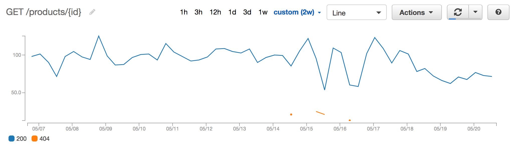

# hapi-cloudwatch

A upgraded hapi plugin for sending request response time metrics to AWS CloudWatch. (Supports Hapi v17 onwards)

[](https://travis-ci.org/clarkie/hapi-cloudwatch)
[](https://coveralls.io/github/clarkie/hapi-cloudwatch)
[](http://badge.fury.io/js/hapi-cloudwatch)
[](https://david-dm.org/clarkie/hapi-cloudwatch)
[](https://david-dm.org/clarkie/hapi-cloudwatch#info=devDependencies)
[](https://snyk.io/test/npm/hapi-cloudwatch)

## Installation

	npm install --save https://github.com/GolBol/hapi-cloudwatch/tarball/master
    

## Usage

To install this plugin on your Hapi server, do something similar to this:

```js
var Hapi = require('hapi');
var server = new Hapi.Server();

var options = {};

server.register({ plugin: require('hapi-cloudwatch'), options })
    .then(function(err) {
        if (err) {
            console.log('error', 'Failed loading plugin: hapi-cloudwatch');
        }
    });
```

## Plugin Options

### `region`

AWS region to send the metrics to.

Defaults to `ap-south-1`

### `environment`

The primary dimension added to the CloudWatch metric

Defaults to `process.env.NODE_ENV`

### `enabled`

Turns on/off the sending of metrics to CloudWatch

Defaults to `true`

### `namespace`

Specify a custom namespace for the metrics

Defaults to `Api Metrics`

### `metricsSentCallback`

A function to call when metrics have been sent to CloudWatch.

Defaults to no-op.

## Example

A Hapi route configured like this:

```js
server.route({
  method: 'GET',
  path: '/products/{id}',
  handler: function(request, h) {
    'Success!';
  }
});
```
and run with `NODE_ENV=production npm start` will send a metric to AWS CloudWatch with the following dimensions:

- metric name: `responseTime`
- environment: `production`
- method: `GET`
- statusCode: `200`
- path: `/products/{id}`

Here's an example of what can be graphed in CloudWatch with this metric:




## Version Compatibility

| Version | [hapi.js](https://github.com/hapijs/hapi) |
| ------- | ----------------------------------------- |
| `^1.1.x`   | `>=17 hapi`                               | 
| `1.0.x`   | `<17 hapi`                                |


## FAQ

1. I'm not able to see metrics in by Cloudwatch Metrics
- Check for your IAM Policy and Role, does it have permission to write metrics to CloudWatch.
